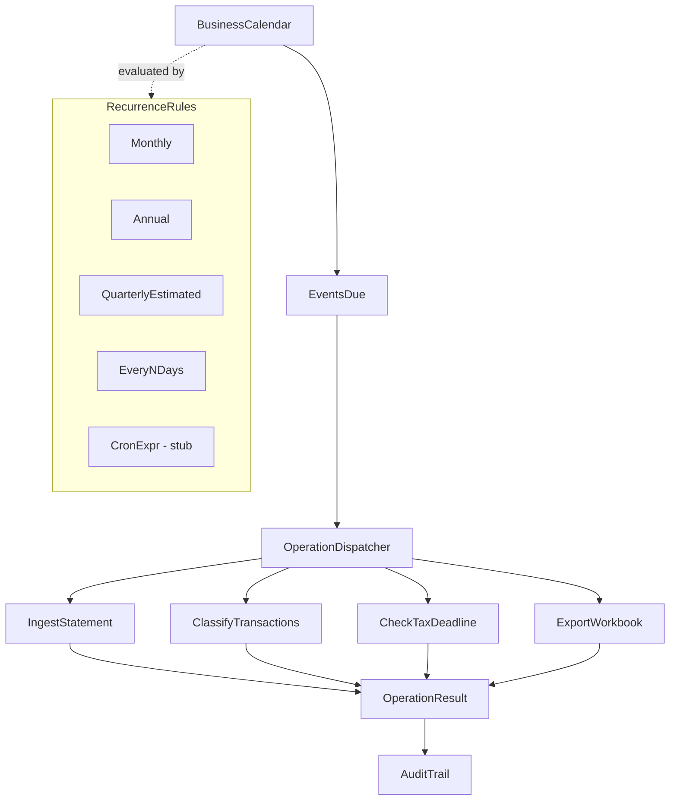

# Business Calendar & Scheduler

## Overview

The business calendar drives deterministic, auditable scheduling for the tax preparation pipeline. Rather than relying on ad-hoc manual triggers, every recurring obligation — quarterly estimated tax payments, BAS lodgements, monthly statement ingest runs — is encoded as a `ScheduledEvent` in a TOML manifest. The `BusinessCalendar` evaluates upcoming events against a horizon window and feeds them to the `OperationDispatcher`.

This approach provides several guarantees critical for expat tax work:

- **No missed deadlines**: US and AU obligations are codified with tax code citations; the scheduler surfaces them before they are due.
- **Reproducible automation**: Monthly ingest and classification runs fire on fixed day-of-month rules, not human memory.
- **Audit trail**: Every dispatched operation records its triggering event ID, so the audit log can be traced back to the calendar manifest.
- **Agent-editable without recompile**: TOML manifests and Rhai dispatch rules can be updated by an agent or operator without rebuilding the Rust binary.

## Calendar-Driven Operation Pipeline

The scheduling loop is expressed as a Rhai function chain. Each step either proceeds or short-circuits based on the result of the previous step.

```rhai
fn check_calendar() -> find_due_events
fn find_due_events() -> dispatch_operations
fn dispatch_operations() -> execute_waterfall
fn execute_waterfall() -> record_completion
if horizon_days > 30 -> warn_upcoming
if horizon_days <= 7 -> escalate_urgent
```

- `check_calendar` — loads the active `BusinessCalendar` and computes today's date relative to each event's `RecurrenceRule`.
- `find_due_events` — returns events whose next fire date falls within the configured horizon window.
- `dispatch_operations` — resolves each event's `OperationKind` and forwards it to the `OperationDispatcher`.
- `execute_waterfall` — runs each operation in dependency order (ingest before classify, classify before export).
- `record_completion` — writes the completion record to the audit trail with the triggering event ID.
- `warn_upcoming` — logs upcoming events beyond 7 days but within the horizon (informational).
- `escalate_urgent` — emits a high-priority notification for events due within 7 days.

## Scheduling Loop Diagram



## US Tax Calendar

Key US federal deadlines encoded in `calendar/tax_calendar_us.toml`:

| Event | Date | Tax Code Citation | Tags |
|-------|------|------------------|------|
| Q1 Estimated Tax Payment | April 15 | IRC §6654 | `estimated_tax`, `quarterly`, `schedule_c` |
| Q2 Estimated Tax Payment | June 15 | IRC §6654 | `estimated_tax`, `quarterly` |
| Q3 Estimated Tax Payment | September 15 | IRC §6654 | `estimated_tax`, `quarterly` |
| Q4 Estimated Tax Payment | January 15 (next year) | IRC §6654 | `estimated_tax`, `quarterly` |
| Form 1040 Filing Deadline | April 15 (June 15 expat auto-extension) | 26 USC §6072 | `annual_return`, `form_1040` |
| Form 1040 Extended Deadline | October 15 | Form 4868 | `annual_return`, `extension`, `form_4868` |
| FBAR (FinCEN Form 114) | April 15 (auto-extension to Oct 15) | 31 USC §5314 | `fbar`, `foreign_accounts`, `fincen_114` |
| FATCA Form 8938 | April 15 | IRC §6038D | `fatca`, `form_8938`, `foreign_assets` |
| Monthly Statement Ingest | 1st of each month | — | `automation`, `ingest`, `recurring` |
| Monthly Classification Run | 2nd of each month | — | `automation`, `classification`, `recurring` |

## AU Tax Calendar

Key Australian tax deadlines encoded in `calendar/tax_calendar_au.toml`:

| Event | Date | Tax Code Citation | Tags |
|-------|------|------------------|------|
| BAS GST Q1 Lodgement | October 28 | ATO BAS program | `bas`, `gst`, `quarterly`, `q1` |
| BAS GST Q2 Lodgement | February 28 | ATO BAS program | `bas`, `gst`, `quarterly`, `q2` |
| BAS GST Q3 Lodgement | April 28 | ATO BAS program | `bas`, `gst`, `quarterly`, `q3` |
| BAS GST Q4 Lodgement | July 28 | ATO BAS program | `bas`, `gst`, `quarterly`, `q4` |
| Individual Tax Return | October 31 | ITAA 1997 | `annual_return`, `individual`, `itaa_1997` |
| Tax Agent Extension | May 15 (next year) | ATO lodgement program | `annual_return`, `extension`, `tax_agent` |
| Concessional Super Contribution | June 30 | ITAA 1997 s.290-180 | `superannuation`, `concessional`, `s290-180` |
| CGT Discount Asset Review | June 30 | ITAA 1997 s.115-A | `cgt`, `capital_gains`, `s115-a`, `discount_method` |
| Monthly Statement Ingest | 1st of each month | — | `automation`, `ingest`, `recurring` |
| Monthly Classification Run | 2nd of each month | — | `automation`, `classification`, `recurring` |

## TOML Format Reference

Each entry in a calendar manifest is a `[[event]]` block:

```toml
[[event]]
id = "fbar_deadline"
# Human-readable description including tax code citation
description = "FinCEN Form 114 (FBAR) deadline — April 15 with auto-extension to October 15 (31 USC §5314)"

# RecurrenceRule — determines when the event fires
# Supported types: Annual, Monthly, QuarterlyEstimated, EveryNDays, CronExpr (stub)
recurrence = { type = "Annual", month = 4, day = 15 }

# OperationKind — the operation dispatched when this event fires
# Supported: CheckTaxDeadline, IngestStatement, ClassifyTransactions,
#            GenerateAuditTrail, ExportWorkbook
operation = { type = "CheckTaxDeadline", deadline_id = "fbar_deadline" }

jurisdiction = "US"   # "US" | "AU" | "UK" | ...
enabled = true        # false to suspend without removing the event
tags = ["fbar", "foreign_accounts", "fincen_114"]
```

Field descriptions:

| Field | Type | Description |
|-------|------|-------------|
| `id` | String | Unique event identifier; referenced in audit trail records |
| `description` | String | Human-readable label; include tax code citation for compliance events |
| `recurrence` | Inline table | `RecurrenceRule` variant with type-specific fields |
| `operation` | Inline table | `OperationKind` variant dispatched on fire |
| `jurisdiction` | String | Regulatory jurisdiction; used to filter calendars per entity |
| `enabled` | Bool | Set `false` to suspend without deleting |
| `tags` | String array | Free-form labels for filtering and grouping |

## Using the Calendar

```rust
use ledger::calendar::{BusinessCalendar, ScheduledEvent};
use chrono::Local;

// Load a TOML calendar manifest
let cal = BusinessCalendar::from_toml_file("calendar/tax_calendar_us.toml")?;

// Find events due within the next 30 days
let today = Local::now().date_naive();
let due = cal.upcoming(today, 30);

for event in &due {
    println!("Due: {} — {}", event.next_date, event.description);
}

// Dispatch all due operations
let dispatcher = OperationDispatcher::new();
for event in due {
    let result = dispatcher.dispatch(&event.operation, &context).await?;
    audit_trail.record(event.id, result);
}
```

Key methods on `BusinessCalendar`:

- `from_toml_file(path)` — parse a TOML manifest from disk; returns `Result<BusinessCalendar>`
- `upcoming(today, horizon_days)` — returns `Vec<ScheduledEvent>` due within `horizon_days`
- `overdue(today)` — returns events whose last expected fire date has passed without a completion record
- `merge(other)` — combine US and AU calendars for multi-jurisdiction entities

## Stub: CronExpr

The `CronExpr` recurrence type is defined in the `RecurrenceRule` enum for forward compatibility but its evaluation is not yet implemented. Calling `next_date()` on a `CronExpr` event returns `None`. This reserves the variant in TOML manifests without blocking the current annual/monthly scheduling paths.

```toml
# CronExpr — planned, not yet evaluated
recurrence = { type = "CronExpr", expr = "0 9 1 * *" }
```

When `CronExpr` evaluation is implemented it will use the `cron` crate and integrate with the existing `upcoming()` method without changes to the TOML format.
