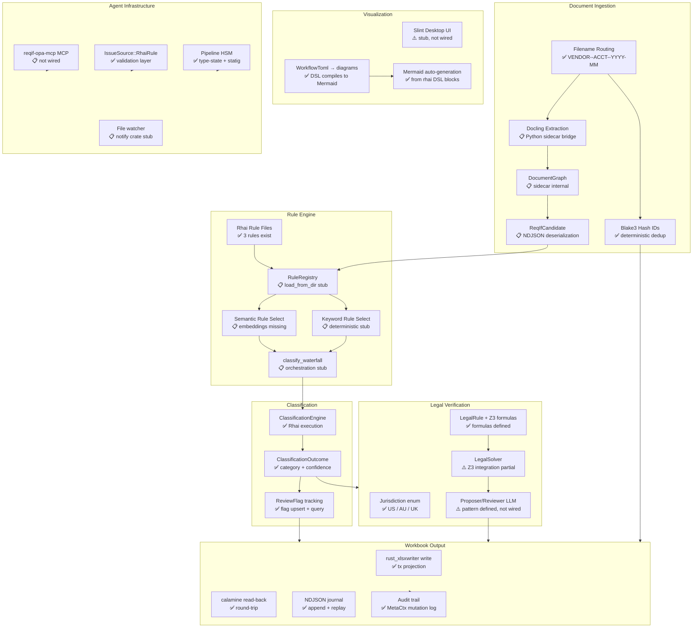

# Capability Map

This chapter provides a complete status map of the l3dg3rr system — every major capability, its current implementation state, and what is needed to complete it.

## System Architecture Diagram



## Component Status Table

| Component | Module | Status | Notes |
|---|---|---|---|
| Filename routing | `filename.rs` | Implemented | `VENDOR--ACCT--YYYY-MM--DOCTYPE` parser |
| Blake3 hash IDs | `ingest.rs` | Implemented | `deterministic_tx_id`, idempotent dedup |
| IngestedLedger | `ingest.rs` | Implemented | Journal + workbook ingest pipeline |
| DocType enum | `document.rs` | Implemented | Document type classification |
| DocumentGraph types | `document.rs` | Implemented | Graph node/edge types defined |
| Pipeline HSM | `pipeline.rs` | Implemented | Type-state + statig state machine |
| Verb trait | `pipeline.rs` | Implemented | DetectVerb, ValidateVerb |
| ClassificationEngine | `classify.rs` | Implemented | Rhai rule execution |
| ClassificationOutcome | `classify.rs` | Implemented | category, confidence, reason |
| ReviewFlag | `classify.rs` | Implemented | Flag upsert, query by year/status |
| Rhai rule files | `rules/` | Implemented | foreign_income, self_employment, fallback |
| Jurisdiction enum | `legal.rs` | Implemented | US, AU, UK |
| LegalRule + Z3 formulas | `legal.rs` | Implemented | Constraint formulas defined |
| LegalSolver | `legal.rs` | Partial | Z3 integration not fully wired |
| Proposer/Reviewer LLM | `verify.rs` | Partial | Pattern defined, no real LLM calls |
| WorkflowToml DSL | `workflow.rs` | Implemented | TOML → Rhai FSM + Mermaid |
| IssueSource::RhaiRule | `validation.rs` | Implemented | Validation layer with rule source |
| Workbook write | `workbook.rs` | Implemented | `rust_xlsxwriter` tx projection |
| Workbook read-back | `workbook.rs` | Implemented | `calamine` round-trip |
| Journal | `journal.rs` | Implemented | NDJSON append and replay |
| Audit trail (MetaCtx) | `pipeline.rs` | Implemented | Mutation log per pipeline state |
| Mermaid auto-generation | `workflow.rs` | Implemented | rhai DSL → diagram blocks |
| Slint desktop UI | `slint_viz.rs` | Partial | Stub, not wired to window system |
| RuleRegistry | `rule_registry.rs` | Stub | `load_from_dir` unimplemented |
| Keyword rule selection | `rule_registry.rs` | Stub | `select_rules_deterministic` unimplemented |
| Waterfall orchestration | `rule_registry.rs` | Stub | `classify_waterfall` unimplemented |
| ReqIfCandidate (Rust) | `rule_registry.rs` | Stub | Type defined, sidecar bridge missing |
| DocumentChunk | `rule_registry.rs` | Stub | Type defined, bridge missing |
| SemanticRuleSelector | `rule_registry.rs` | Stub | Trait defined, embeddings not wired |
| Docling extraction bridge | — | Missing | Python subprocess call not written |
| reqif-opa-mcp MCP wiring | — | Missing | No Rust MCP client for sidecar |
| Vector embedding index | — | Missing | No embedding model or HNSW index |
| File watcher (notify) | — | Missing | `notify` crate not yet wired |

## North Star Pipeline (Rhai DSL)

The following DSL block describes the full intended end-to-end system flow — the "north star" that all stub work is building toward.

```rhai
fn document_ingest() -> reqif_extract
fn reqif_extract() -> opa_gate
fn opa_gate() -> rule_registry
fn rule_registry() -> classify_waterfall
fn classify_waterfall() -> legal_verify
fn legal_verify() -> workbook_commit
fn workbook_commit() -> audit_trail
```

Each step in this pipeline has a corresponding Rust type or trait. The pipeline will be executable end-to-end once the `reqif-opa-mcp` bridge, `RuleRegistry` orchestration, and `LegalSolver` Z3 wiring are complete.

## Next Steps

The five highest-value missing capabilities to implement, in priority order:

1. **`RuleRegistry::load_from_dir` + `classify_waterfall`** — Wire the three existing `.rhai` rule files into the waterfall model. This unblocks multi-rule classification without requiring any external infrastructure. Estimated scope: ~150 lines in `rule_registry.rs`.

2. **Docling extraction bridge** — Write the Rust `std::process::Command` call to invoke the Python sidecar, parse its NDJSON stdout, and deserialize into `DocumentChunk` / `ReqIfCandidate`. This is the critical path for Phase 2 document intelligence. Estimated scope: new `sidecar.rs` module, ~100 lines.

3. **`LegalSolver` Z3 wiring** — Complete the Z3 constraint solver integration in `legal.rs`. Z3 formulas are already defined; the gap is the `z3::Context` / `z3::Solver` call site and result mapping. Estimated scope: ~80 lines in `legal.rs`.

4. **File watcher via `notify`** — Add a debounced `notify` watcher on the workbook path and the `rules/` directory. This enables live rule reloading and human Excel-edit detection without polling. Estimated scope: new `watcher.rs` module, ~60 lines.

5. **`SemanticRuleSelector` embedding index** — Wire a local `fastembed-rs` or ONNX embedding model to encode transaction descriptions and `ReqIfCandidate` texts. Build an HNSW index over candidate embeddings for cosine-similarity rule selection. Estimated scope: ~200 lines, depends on item 2.
