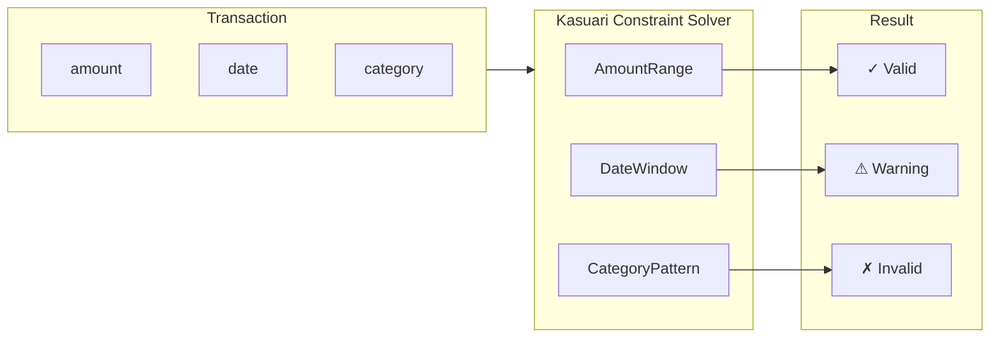

# Constraints

The constraints module implements Kasuari-based data plausibility validation.



## VendorConstraintSet

```rust
pub struct VendorConstraintSet {
    pub vendor: String,
    pub constraints: Vec<Constraint>,
}
```

## Constraint Types

- **AmountRange**: Valid transaction amount bounds
- **DateWindow**: Expected date range for statements
- **DescriptionPattern**: Regex pattern for valid descriptions
- **AccountFormat**: Valid account number format

## Kasuari Integration

The module uses Kasuari strengths for constraint evaluation:
- **Strong**: Must pass for validation to succeed
- **Medium**: Warning if violated
- **Weak**: Advisory if violated

## InvoiceConstraintSolver

```rust
pub struct InvoiceConstraintSolver {
    // ...
}
```

Solves constraints for invoice data with multi-pass validation.