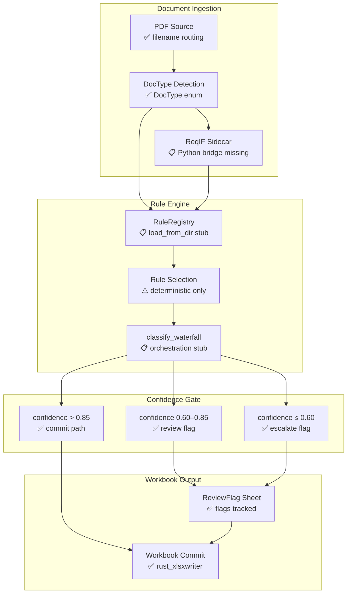

# Rule Engine

The rule engine is the classification core of l3dg3rr. It applies a set of Rhai rule files to each ingested transaction to assign a tax category, confidence score, and optional review flag. Rules are authored as standalone `.rhai` files and executed at runtime without recompilation.

## Classification Pipeline

Rules execute in a **waterfall** model: each rule is tried in order, and the first rule that returns a category other than `"Unclassified"` wins. This keeps individual rules simple and composable while still handling complex multi-category edge cases.

```rhai
// Multi-rule waterfall: first non-Unclassified result wins
fn load_rules() -> select_applicable
fn select_applicable() -> run_waterfall
fn run_waterfall() -> evaluate_confidence
fn evaluate_confidence() -> emit_result
```

The pipeline nodes map to Rust types:

| Pipeline step | Rust type | Status |
|---|---|---|
| `load_rules` | `RuleRegistry::load_from_dir` | Stub (unimplemented) |
| `select_applicable` | `RuleRegistry::select_rules_deterministic` | Stub (unimplemented) |
| `run_waterfall` | `RuleRegistry::classify_waterfall` | Stub (unimplemented) |
| `evaluate_confidence` | `ClassificationOutcome.confidence` | Implemented |
| `emit_result` | `ClassifiedTransaction` / `ReviewFlag` | Implemented |

## Rule Selection

Before running the waterfall, applicable rules are selected from the registry. A confidence gate then routes the result to either a commit or a manual review queue.

```rhai
if confidence > 0.85 -> commit
if confidence > 0.60 -> review
if confidence <= 0.60 -> escalate
```

The thresholds are configurable per deployment. The `review` path creates a `ReviewFlag` in the workbook's Flags sheet. The `escalate` path promotes the flag to a high-priority manual item.

## Architecture Overview

The diagram below shows the full classification pipeline from document ingestion through workbook commit. Each node is tagged with its current implementation status.



## Rule Authoring

Rules are standalone `.rhai` files that implement a single `fn classify(tx)` function. The function receives a transaction map and returns a map with fields: `category`, `confidence`, `review`, `reason`.

See [docs/rhai-rules.md](../docs/rhai-rules.md) for the complete rule authoring guide, including field contracts, available built-ins, and worked examples for `foreign_income`, `self_employment`, and `fallback` rules.

The three rules currently shipping with the system are:

- `rules/foreign_income.rhai` — matches foreign-sourced income transactions
- `rules/self_employment.rhai` — matches self-employment / Schedule C income
- `rules/fallback.rhai` — catch-all returning `Unclassified` with `review: true`

## Stub: Semantic Rule Selection

`SemanticRuleSelector` is the planned upgrade to the deterministic keyword-match selector. It will use vector embeddings to rank rules by semantic similarity to a transaction's description, drawing on `ReqIfCandidate` objects produced by the `reqif-opa-mcp` Python sidecar.

```rust
pub trait SemanticRuleSelector {
    fn select_rules_semantic(&self, tx: &SampleTransaction, top_k: usize) -> Vec<PathBuf>;
    fn build_embedding_index(&mut self) -> Result<(), RuleRegistryError>;
}
```

This is `unimplemented!()` today because it requires:

1. **Embedding model** — a local ONNX or `fastembed-rs` model to encode transaction text
2. **ReqIfCandidate index** — `ReqIfCandidate` objects loaded from the Python sidecar
3. **Vector similarity** — cosine distance or HNSW index over candidate embeddings

Until those are wired, `select_rules_deterministic` provides a stable keyword-match fallback. See [Document Ingestion](./document-ingestion.md) for the full sidecar bridge plan.
