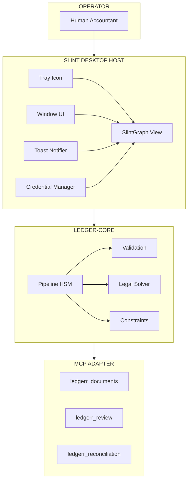
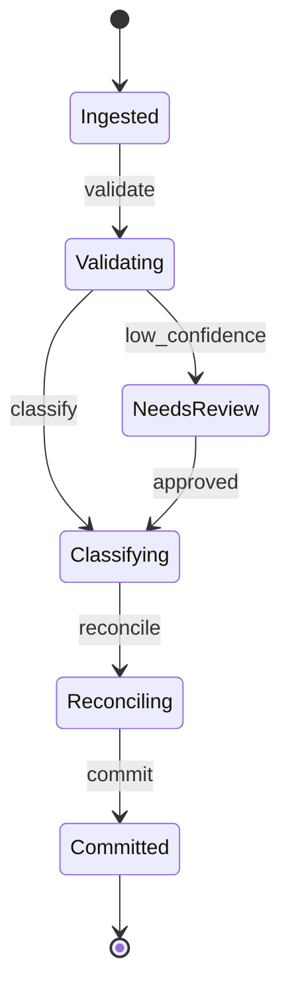
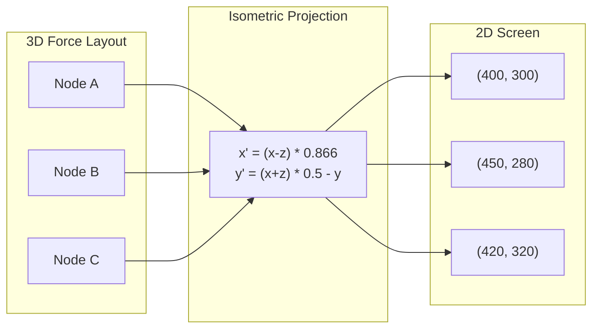
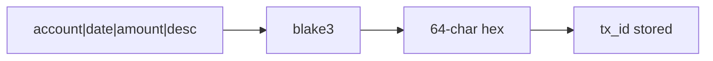

# Theory of Operation

This chapter documents the novel architecture patterns that power l3dg3rr's AI agent governance system.

## Related Chapters

- [Graph Data Model](./graph.md) - Node and edge definitions
- [Force Layout](./layout.md) - Force-directed positioning
- [Isometric Projection](./iso.md) - 3D to 2D mapping
- [Pipeline](./pipeline.md) - Type-state workflow
- [Validation](./validation.md) - Confidence accumulation
- [Visualization](./visualize.md) - Mermaid/HTML export
- [Legal Verification](./legal.md) - Tax rule verification
- [Constraints](./constraints.md) - Kasuari constraints

## The Novel Theory of Tool Pattern

### Concept

Traditional tool use in LLM agents treats tools as stateless functions that transform inputs to outputs. The **Novel Theory of Tool (NTTP)** pattern instead treats tools as **stateful instruction executors** with:
```rhai
// Rhai patterns auto-parse to Mermaid
fn ingest() -> validate
fn validate() -> classify
fn classify() -> reconcile
fn reconcile() -> commit
```

Conditional flow:
```rhai
if confidence > 0.8 -> commit
if confidence > 0.5 -> reconcile  
if confidence <= 0.5 -> review
if review == approved -> classify
```

1. **Composable instruction streams** - Tools accept not just data, but *instructions* that modify their behavior
2. **Idempotent re-execution** - Tools can be safely re-run with the same inputs, producing deterministic outputs
3. **Content-addressed identity** - All outputs are identified by cryptographic hashes of their inputs
4. **Audit-native design** - Every tool execution produces traceable evidence

### Executable Pattern Example

```rust
use ledger_core::{graph::*, layout::*, render::*};

// Create a pipeline graph
let nodes = create_pipeline_nodes();
let edges = create_pipeline_edges();

// Initialize force layout
let mut layout = ForceLayout::for_pipeline();

// Run simulation
for _ in 0..50 {
    layout.tick();
}

// Render to screen coordinates
let renderer = GraphRenderer::new(800, 600);
for (idx, _) in nodes.iter().enumerate() {
    if let Some(pos) = layout.position(idx) {
        let screen = renderer.screen_position(pos.x, pos.y, pos.z);
        println!("Node {} -> ({:.1}, {:.1})", idx, screen.x, screen.y);
    }
}
```

### Comparison

| Traditional Tool Use | Novel Theory of Tool |
|---------------------|---------------------|
| `fn(input) -> output` | `fn(instruction, state) -> (output, evidence)` |
| Stateless | Stateful with checkpointing |
| Random UUIDs | Content-hash IDs |
| Best-effort | Deterministic/auditable |

## System Architecture Diagram



## Pipeline Flow Diagram



## LLM Verification Pattern

```mermaid
sequenceDiagram
    participant P as Proposer LLM
    participant S as Decision Store
    participant R as Reviewer LLM
    
    P->>S: propose(category, confidence)
    S->>R: review(proposal)
    R-->>S: verdict(agreed, evidence)
    S-->>P: result(confidence, issues)

## Executable LLM Pipeline Integration

### Proposer/Reviewer Pattern

The verification system uses a two-model approach for classification quality:

```rust
use ledger_core::verify::Verifier;
use ledger_core::validation::{Disposition, MetaCtx};

// Initialize verifier with two models
let verifier = Verifier::new(proposer_model.clone(), reviewer_model.clone());

// Propose classification
let proposal = verifier.propose(&transaction, "OfficeSupplies");

// Reviewer evaluates
let review = verifier.review(&proposal);

// Combine into result with confidence
let confidence = if review.agreed {
    proposal.confidence * 0.95  // High agreement boost
} else {
    proposal.confidence * 0.5   // Disagreement penalty
};
```

### Multi-Stage Classification Flow (Executable)

```rust
use ledger_core::{graph::*, layout::*, pipeline::*, validation::*};

// Complete pipeline execution
fn run_pipeline(document_path: &str) -> Result<PipelineState<Committed>, Issue> {
    // Stage 1: Ingest
    let data = std::fs::read(document_path)?;
    let tx_id = blake3::hash(&data).to_hex();
    let state = PipelineState::new(Ingested { tx_id, data });
    
    // Stage 2: Validate (Kasuari constraints + Z3 legal)
    let ctx = MetaCtx::default();
    let validated = state.validate(&ctx)?;
    
    // Stage 3: Classify (LLM → Reviewer → Human if needed)
    let classified = validated.classify("OfficeSupplies".to_string())?;
    
    // Stage 4: Reconcile (Xero)
    let reconciled = classified.reconcile(Some(xero_id))?;
    
    // Stage 5: Commit (Audit log + schedule)
    Ok(reconciled.commit()?)
}
```

## Isometric Visualization (Executable)

### 3D Force Layout to 2D Screen



### State Visualization Mapping

```rust
use ledger_core::{graph::*, layout::*, render::*};

// Full visualization pipeline
fn visualize_pipeline() -> String {
    // 1. Create graph data
    let nodes = create_pipeline_nodes();
    
    // 2. Run force-directed layout
    let mut layout = ForceLayout::for_pipeline();
    for _ in 0..100 { layout.tick(); }
    
    // 3. Render to screen coordinates
    let renderer = GraphRenderer::new(800, 600);
    let mut positions = Vec::new();
    for (idx, node) in nodes.iter().enumerate() {
        if let Some(pos) = layout.position(idx) {
            let screen = renderer.screen_position(pos.x, pos.y, pos.z);
            positions.push((node.label.clone(), screen));
        }
    }
    
    // 4. Generate Mermaid diagram
    let mut mermaid = String::from("stateDiagram-v2\n");
    for (label, _) in &positions {
        mermaid.push_str(&format!("    {}: {}\n", label, label));
    }
    mermaid
}
```

### State Visualization Mapping

| Pipeline State | Visual Node | Color | Animation |
|---------------|-------------|-------|-----------|
| Idle | Empty circle | #f0f0f0 | None |
| Active | Filled circle | #4a90d9 | Pulse |
| Success | Checkmark | #4caf50 | Check |
| Warning | Triangle | #ff9800 | Shake |
| Error | X mark | #f44336 | Blink |
| Review | Star | #9c27b0 | Bounce |

## Integration Test Recipes

### CI/CD Test Matrix

```yaml
# .github/workflows/ci.yml
test-recipes:
  - name: e2e-mvp
    command: ./scripts/e2e_mvp.sh
    validates: full ingest → classify → audit → schedule

  - name: visualization-render
    command: cargo test --package ledgerr-host visualization_e2e
    validates: isometric graph rendering

  - name: mdbook-build
    command: mdbook build book
    validates: documentation generation

  - name: mcp-surface-contract
    command: cargo run -p xtask-mcpb -- generate-mcp-artifacts
    validates: MCP tool contract matches code
```

### Executable Documentation Tests

```rust
// Tests that verify documentation examples work
#[cfg(test)]
mod doc_tests {
    use ledger_core::{graph::*, layout::*, render::*, visualize::*};
    
    #[test]
    fn test_force_layout_tick() {
        let mut layout = ForceLayout::for_pipeline();
        let initial = layout.position(0);
        
        layout.tick();
        
        // Position should change after tick
        assert_ne!(initial, layout.position(0));
    }
    
    #[test]
    fn test_isometric_projection() {
        let renderer = GraphRenderer::new(800, 600);
        
        // Center position should map near origin
        let center = renderer.screen_position(0.0, 0.0, 0.0);
        assert!((center.x - 400.0).abs() < 1.0);
        assert!((center.y - 300.0).abs() < 1.0);
    }
    
    #[test]
    fn test_pipeline_state_transitions() {
        let state = PipelineState::new(Ingested { 
            tx_id: "test123".to_string(),
            data: vec![1, 2, 3] 
        });
        
        let ctx = MetaCtx::default();
        let validated = state.validate(&ctx).unwrap();
        
        assert!(matches!(validated, PipelineState::Validating(_)));
    }
}
```

## Multi-Jurisdiction Tax Rules (Executable)

### Jurisdiction Activation

```rust
use ledger_core::legal::{LegalSolver, Jurisdiction, TaxRule};

// US Tax Rules
let us_rules = vec![
    TaxRule::new("schedule_c_expense", Jurisdiction::US, 
        "Business expense deduction",
        |tx| tx.category == "BusinessExpense"),
];

// AU Tax Rules  
let au_rules = vec![
    TaxRule::new("gst_credit", Jurisdiction::AU,
        "GST input credit",
        |tx| tx.gst_included && tx.amount > 100.0),
];

// Verify against jurisdiction
let solver = LegalSolver::with_rules(Jurisdiction::US, us_rules);
let result = solver.verify(&transaction);

match result.disposition {
    Disposition::Unrecoverable => panic!("Fatal tax issue"),
    Disposition::Recoverable => println!("Fix: {}", result.message),
    Disposition::Advisory => println!("Suggestion: {}", result.message),
}
```

## Content-Hash Identity Model

### Idempotent Ingest (Executable)

```rust
use blake3::hash;

// Generate deterministic transaction ID
fn compute_tx_id(account: &str, date: &str, amount: f64, desc: &str) -> String {
    let input = format!("{}|{}|{}|{}", account, date, amount, desc);
    hash(input.as_bytes()).to_hex().to_string()
}

// Example: Same inputs produce same ID (idempotent)
let id1 = compute_tx_id("WF-BH-CHK", "2024-01-15", 150.00, "Office Depot");
let id2 = compute_tx_id("WF-BH-CHK", "2024-01-15", 150.00, "Office Depot");
assert_eq!(id1, id2); // Idempotent!
```

### Content-Hash Flow



## Workflow DSL Compilation (Executable)

### TOML → Triple Compilation

```rust
use ledger_core::workflow::{WorkflowToml, compile_mermaid, compile_rhai, compile_rust_enum};

// Parse TOML workflow definition
let toml_str = r#"
[[state]]
id = "Ingested"
[[state]]
id = "Validating"
[[transition]]
from = "Ingested"
to = "Validating"
"#;

let workflow: WorkflowToml = toml::from_str(toml_str).unwrap();

// Compile to three outputs
let mermaid = compile_mermaid(&workflow);
let rhai = compile_rhai(&workflow);
let rust_enum = compile_rust_enum(&workflow);

println!("Mermaid:\n{}", mermaid);
println!("\nRhai:\n{}", rhai);
println!("\nRust:\n{}", rust_enum);
```

## Verb Pattern (Executable)

### Reversible Operations

```rust
use ledger_core::pipeline::*;

// Ingest with idempotency
let result1 = service.ingest_statement_rows(rows.clone())?;
assert_eq!(result1.inserted_count, 1);

let result2 = service.ingest_statement_rows(rows)?;  // Same rows
assert_eq!(result2.inserted_count, 0);  // Idempotent - no dup!

// Classification with confidence
let updated = service.classify_transaction(ClassifyTransactionRequest {
    tx_id,
    category: "OfficeSupplies".to_string(),
    confidence: "0.93".to_string(),
    actor: "agent".to_string(),
})?;
assert_eq!(updated.category, "OfficeSupplies");
```