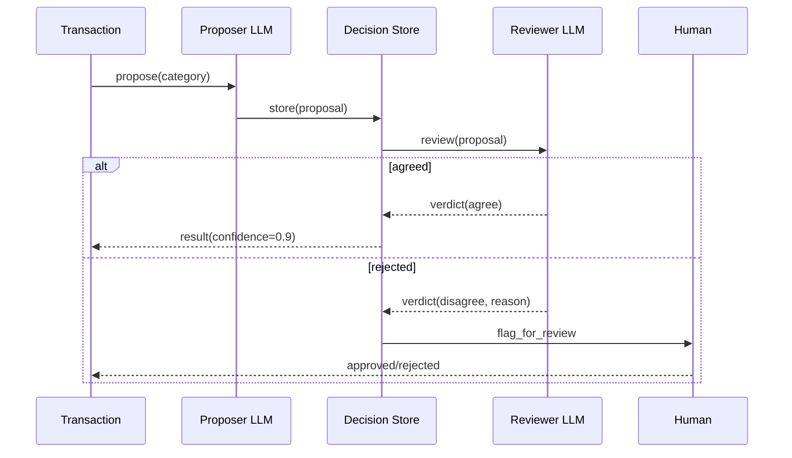

# Verification

The verify module implements multi-model verification for quality assurance.

## Multi-Model Verification



The system uses a two-model approach:
1. **Proposer**: Primary model generates the classification/decision
2. **Reviewer**: Second model reviews and validates the proposal

## Verifier

```rust
pub struct Verifier {
    proposer: ModelClient,
    reviewer: ModelClient,
}
```

## Process

1. Proposer generates a candidate classification
2. Reviewer evaluates the candidate against constraints
3. If reviewer rejects, human review is flagged
4. Confidence score reflects agreement between models

## Usage

```rust
let verifier = Verifier::new(model_a, model_b);
let result = verifier.verify(&transaction, Proposal::Classify);
```