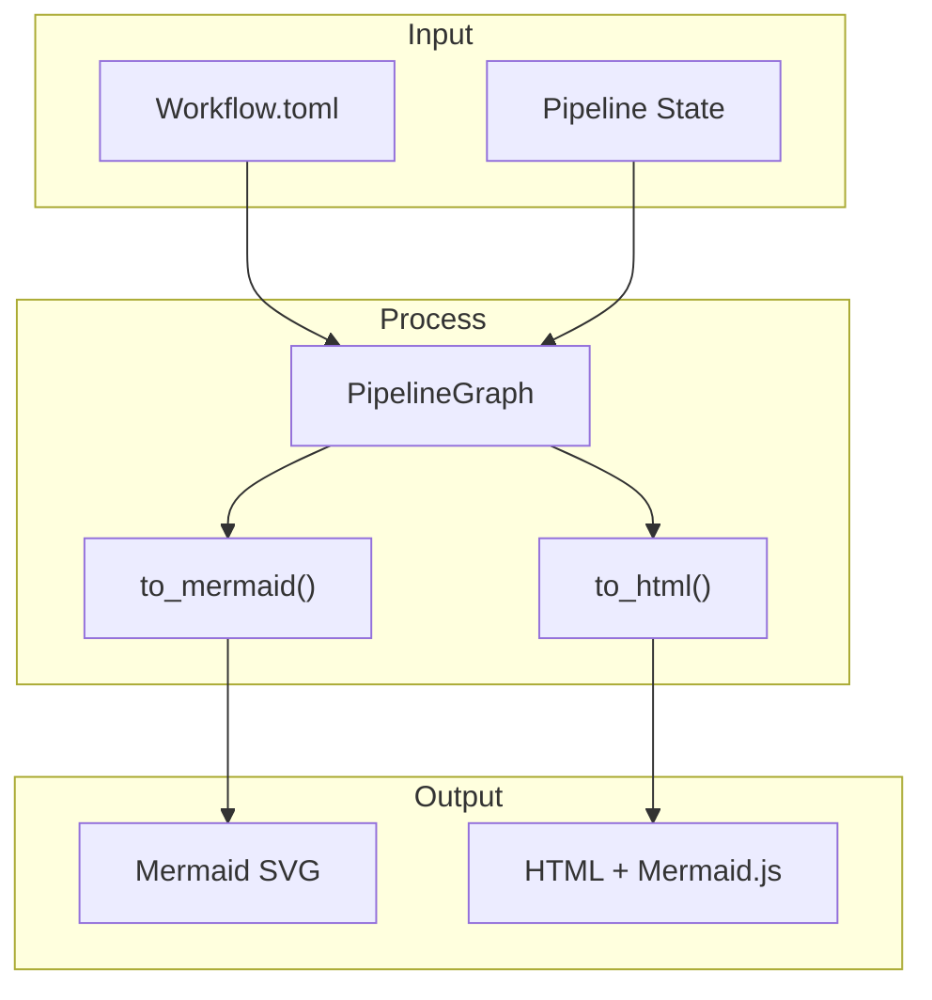

# Visualization

The visualize module generates Mermaid diagrams and HTML exports for pipeline state.

## Related Chapters

- [Pipeline](./pipeline.md) - State definitions
- [Layout](./layout.md) - Position calculations
- [Render](./render.md) - Screen coordinate mapping
- [Slint Viz](./slint_viz.md) - Slint integration

## PipelineGraph



```rust
pub struct PipelineGraph {
    pub nodes: HashMap<String, NodeVisualState>,
    pub edges: Vec<EdgeVisual>,
    pub current_state: String,
    pub accumulated_confidence: f32,
}
```

## NodeVisualState

Visual states for pipeline nodes:
- **Idle**: Waiting, not entered
- **Active**: Currently executing
- **Success**: Completed successfully
- **Warning**: Recoverable issue
- **Error**: Unrecoverable issue
- **Review**: Awaiting human review

## Mermaid Generation

```rust
let mermaid = graph.to_mermaid();
// Generates stateDiagram-v2
```

## Live Rhai Editor

The rendered book now upgrades generated Rhai diagram blocks into a local editor + preview surface. Use `just docserve`, open the book in a browser, edit a supported ` ```rhai ` block, and click `Regenerate` to redraw the chart without changing the source markdown.

The live editor uses the same narrow diagram DSL as the mdBook preprocessor:
- `fn source() -> target`
- `if expression -> target`

Diagnostics now surface line-level parse feedback:
- malformed DSL lines are marked as errors
- ignored non-DSL lines are marked as informational notes
- render failures include Mermaid load guidance when the global runtime is unavailable

## HTML Export

```rust
let html = to_html(&graph);
// Returns complete HTML with Mermaid.js
```

## LayoutSolver

Kasuari-backed constraint solver for node positioning:

```rust
pub struct LayoutSolver;
pub fn generate_layout(&self, graph: &PipelineGraph) -> HashMap<String, (f32, f32)>;
```
